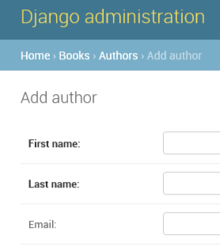
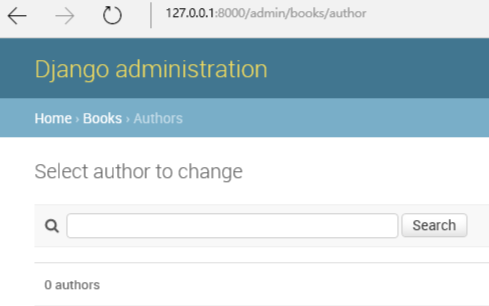
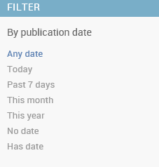

## [the django book](http://djangobook.py3k.cn/2.0/)  
---
## 目录
* [第二章](#2)
* [第三章 视图和URL配置](#3)
* [第四章 模板（Template）](#4)
* [第五章 模型（Models）](#5)
* [第六章 Django站点管理](#6)
* [第七章 表单](#7)
* [第八章 高级视图和URL配置](#8)  
  
---
### <a id="2"></a>第二章

创建一个项目：  
`> django-admin.py startproject mysite`

运行服务器：  
`> python manage.py runserver`
  
  
### <a id="3"></a>第三章 视图和URL配置

创建 **view.py** （视图）  
编写 **views.py**（动态内容） :  
```Python
# -*- coding: utf-8 -*-

from django.http import HttpResponse
from django.shortcuts import render_to_response
import datetime

def hello(request):     # request 必须为第一个参数
    return HttpResponse(u'你好, world')     # 返回实例化


def current_datetime(request):
    
    now = datetime.datetime.now()
    
    #t = get_template('current_datetime.html')
    #html = t.render(({'current_date': now}))    #传入参数必须为dict，t.render(Context('':now)报错)
    
    return render_to_response('current_datetime.html', {'current_date':now})
                                #返回HttpResponse对象
                                #第一个参数必须为模板名称，第二个参数为Context dict，若无则使用空dict
                                # locals() 可传入当前所有局部变量
                                #代码可进一步修改，replace('current_date', 'now'), replace(locals(), dict)

def hours_ahead(request, offset):   #多了一个参数offset表示时间差
    try:                            
        offset = int(offset)
    except ValueError:
        raise Http404()             #捕获异常，raise一个404Error
    dt = datetime.datetime.now() + datetime.timedelta(hours = offset)
    #assert False
    #html = '<html><body>In %s hour(s), it will be %s.</body></html>' % (offset,dt)
    return render_to_response('hours_ahead.html', {'hour_offset':offset, 'next_time':dt})

```

绑定视图函数和URL
修改**urls.py**（配置松耦合，动态url）:
```python
from django.conf.urls import url
from django.contrib import admin

from mysite.views import hello, current_datetime, hours_ahead   #首先import

urlpatterns = [
    url(r'^admin/', admin.site.urls),
    url(r'^hello/$', hello),     # 找到网址里有/hello/就去call views.py 里的 hello
    url(r'^time/$', current_datetime),
    url(r'^time/plus/(\d{1,2})/$', hours_ahead),     #re
]
```

查看网站根目录使用空re:  
`url(r'^$', my_homepage_view)`


### <a id="4"></a>第四章 模板（Template）
|模板标记|  |
|----|----|
|{{ person_name }}|变量(variable)|
||模板标签(template tag)|
|{{ship_date\|date:"F j, Y"}}|filter过滤器|

创建Template对象：直接将其实例化
```Python
>>> from django.template import Template
>>> t = Template('My name is {{ name }}.')
```

context在Django里表现为 Context 类，在 django.template 模块里。 她的构造函数带有一个可选的参数： 一个字典映射变量和它们的值。 调用 Template 对象 的 render() 方法并传递context来填充模板：
```Python
>>> from django.template import Context, Template    
          #context在Django里表现为 Context 类，在 django.template 模块里
>>> t = Template('My name is {{ name }}.')
>>> c = Context({'name': 'Stephane'})
          #字典映射 变量 和 值
>>> t.render(c)
u'My name is Stephane.
```
在 Django 模板中遍历复杂数据结构的关键是句点字符 (.)
```Python
>>> from django.template import Template, Context
>>> person = {'name': 'Sally', 'age': '43'}
>>> t = Template('{{ person.name }} is {{ person.age }} years old.')
>>> c = Context({'person': person})
>>> t.render(c)
u'Sally is 43 years old.'
```
句点查找可以多级深度嵌套。 例如在下面这个例子中 {{person.name.upper}} 会转换成字典类型查找（ person['name'] ) 然后是方法调用（ upper() ):
```Python
>>> from django.template import Template, Context
>>> person = {'name': 'Sally', 'age': '43'}
>>> t = Template('{{ person.name.upper }} is {{ person.age }} years old.')
>>> c = Context({'person': person})
>>> t.render(c)
u'SALLY is 43 years old.'
```
|模板标记| |
|----|----|
|标签||
|注释|{# blah #}|
|过滤器|{{ name\|lower }}|

模板加载：
修改**settings.py**:   
```python
TEMPLATES = [
    {
        'BACKEND': 'django.template.backends.django.DjangoTemplates',
        'DIRS': [
            'E:/Python/django/mysite/templates',
            #os.path.join(os.path.dirname(__file__), 'templates').replace('\\','/'),
            ],
        ......
        ......
}
```  

（继续修改**views.py**:）且慢！还有更好的方法！  
`django.template.loader.get_template() `     #自动加载模板    
  

在template中创建模板**current_datetime.html**：

`render_to_response()`  

```Python
from django.shortcuts import render_to_response
import datetime

def current_datetime(request):
    now = datetime.datetime.now()
    return render_to_response('current_datetime.html', {'current_date': now})
```
不再需要导入 get_template 、 Template 、 Context 和 HttpResponse 。相反，导入 `django.shortcuts.render_to_response`
 
**locals() 技巧**

**模板继承：**` `   
**base.html**
```html
<!DOCTYPE HTML PUBLIC "-//W3C//DTD HTML 4.01//EN">
<html lang="en">
<head>
    <title></title>
</head>
<body>
    <h1>My helpful timestamp site</h1>
    
    
    <hr>
    <p>Thanks for visiting my site.</p>
    
</body>
</html>
```
**current_datetime.html**  
```html


The current time


<p>It is now {{ current_date }}.</p>

``` 
**hours_ahead.html**  
```html


Future time


<p>In {{ hour_offset }} hour(s), it will be {{ next_time }}.</p>

```
  
    
如果需要访问父模板中的块的内容，使用 **{{ block.super }}**，这一个魔法变量将会表现出父模板中的内容。 如果只想在上级代码块基础上添加内容，而不是全部重载，该变量就显得非常有用了。


### <a id="5"></a>第五章 模型（Models）

修改**setings.py**:
```python
DATABASES = {
    'default': {
        'ENGINE': 'django.db.backends.sqlite3',
        'NAME': 'E:/Python/django/mysite/mydb.db',
        'USER': '',
        'PASSWORD': '',
        'HOST': '',
    }
}
```
shell中检测数据库配置 ：
```Python
>>> from django.db import connection
>>> cursor = connection.cursor()
```
创建"books"app:   
`python manage.py startapp books`

编写**models.py**:
```python
from django.db import models

# Create your models here.
# 每个数据模型都是django.db.models.Model的子类

class Publishier(models.Model):     #所有模型自动拥有objects管理器，查找数据时使用
    name = models.CharField(max_length = 30)
    address = models.CharField(max_length = 50)
    city = models.CharField(max_length = 60)
    state_province = models.CharField(max_length = 30)
    country = models.CharField(max_length = 50)
    website = models.URLField()

    def __str__(self):
        return self.name 

    #class Meta:
    #   ordering = ['name']

class Author(models.Model):
    first_name = models.CharField(max_length = 30)
    last_name = models.CharField(max_length = 40)
    email = models.EmailField()     
                                

    def __str__(self):
        return u'%s %s' % (self.first_name, self.last_name)

class Book(models.Model):
    title = models.CharField(max_length = 100)
    authors = models.ManyToManyField(Author)        #多对多
    publishier = models.ForeignKey(Publishier)      #一对多
    publication_date = models.DateField()  

    def __str__(self):
        return self.title
```


修改**settings.py**:
```python
INSTALLED_APPS = [
    'django.contrib.admin',
    'django.contrib.auth',      #用户鉴别系统
    'django.contrib.contenttypes',
    'django.contrib.sessions',     #支持匿名会话
    'django.contrib.messages',
    'django.contrib.staticfiles',
    'books',
]
```


验证模型有效型：   
`python manage.py check`
返回0 errors found

生成**create table**:
```Python
>python manage.py makemigrations books
         #用来检测数据库变更和生成数据库迁移文件
>python manage.py sqlmigrate books 0001
         #用来把数据库迁移文件转换成数据库语言
>python manage.py migrate                     
         #用来迁移数据库
```
基本数据访问：
```Python
>>> from books.models import Publisher
>>> p1 = Publisher(name='Apress', address='2855 Telegraph Avenue',
...     city='Berkeley', state_province='CA', country='U.S.A.',
...     website='http://www.apress.com/')
>>> p1.save()
>>> p2 = Publisher(name="O'Reilly", address='10 Fawcett St.',
...     city='Cambridge', state_province='MA', country='U.S.A.',
...     website='http://www.oreilly.com/')
>>> p2.save()
>>> publisher_list = Publisher.objects.all()
>>> publisher_list
<QuerySet [<Publisher: Publisher object>, <Publisher: Publisher object>]>
```
.save 或用 objects.create() 方法:
```Python
>>> p1 = Publisher.objects.create(name='Apress',
...     address='2855 Telegraph Avenue',
...     city='Berkeley', state_province='CA', country='U.S.A.',
...     website='http://www.apress.com/')
>>> p2 = Publisher.objects.create(name="O'Reilly",
...     address='10 Fawcett St.', city='Cambridge',
...     state_province='MA', country='U.S.A.',
...     website='http://www.oreilly.com/')
>>> publisher_list = Publisher.objects.all()
>>> publisher_list
```
每个models模块添加方法__str__()：
```Python
def __str__(self):
        return self.name
```
输出结果对比：
```Python
<QuerySet [<Publishier: object>, <Publishier: object>]>
<QuerySet [<Publishier: O'Reilly>, <Publishier: Apress>]>
```
插入和更新数据：
```Python
>>> p.name = 'Apress Publishing'
>>> p.save()
```
选择对象：
```Python
>>> Publisher.objects.all()
<QuerySet [<Publishier: Apress>, <Publishier: O'Reilly>]>
```
数据过滤：
```Python
filter():
>>> Publisher.objects.filter(name='Apress')
[<Publisher: Apress>]
```
可传入多个参数：
```Python
>>> Publisher.objects.filter(country="U.S.A.", state_province="CA")
[<Publisher: Apress>]
```
\_\_contains:
```Python
>>> Publishier.objects.filter(name__contains="press")
[<Publisher: Apress>]
```
获取单个对象：
`get()`:
```python
>>> Publisher.objects.get(name="Apress")
<Publisher: Apress>
```
`filter()`和`get()`:
```python
>>> type(Publishier.objects.filter(name='Apress'))
<class 'django.db.models.query.QuerySet'>
>>> type(Publishier.objects.get(name='Apress'))
<class 'books.models.Publishier'>
```
数据排序：
`order_by()`:
```python
>>> Publisher.objects.order_by("name")
[<Publisher: Apress>, <Publisher: O'Reilly>]
```
可对任意字段：
```python
>>> Publisher.objects.order_by("address")
[<Publisher: O'Reilly>, <Publisher: Apress>]

>>> Publisher.objects.order_by("state_province")
[<Publisher: Apress>, <Publisher: O'Reilly>]
```
逆向：
```python
>>> Publisher.objects.order_by("-name")
[<Publisher: O'Reilly>, <Publisher: Apress>]
```
重复排序可定义 class Meta：
```Python
class Meta:
     ordering = ['name']
```
连锁查询：
```python
>>> Publisher.objects.filter(country="U.S.A.").order_by("-name")
[<Publisher: O'Reilly>, <Publisher: Apress>]
```
限制返回数据：
```python
>>> Publisher.objects.order_by('name')[0]
<Publisher: Apress>
>>> Publisher.objects.order_by('name')[0:2]
>>> Publisher.objects.order_by('-name')[0]
```
更新多个对象：
```python
>>> p = Publisher.objects.get(name='Apress')
>>> p.name = 'Apress Publishing'
>>> p.save()
>>>
>>> #假设id为52
>>> Publisher.objects.filter(id=52).update(name='Apress Publishing')
>>>
>>>>>> Publisher.objects.all().update(country='USA')
2
```
删除对象：
`delete()`:
```python
>>> p = Publisher.objects.get(name="O'Reilly")
>>> p.delete()
>>> Publisher.objects.all()
[<Publisher: Apress Publishing>]
>>>
>>> Publisher.objects.filter(country='USA').delete()
>>> Publisher.objects.all().delete()
```  
  
  
### <a id="6"></a>第六章 Django站点管理

激活管理界面：  
修改**settings.py**:
```python
INSTALLED_APPS = [
    'django.contrib.admin',
    'django.contrib.auth',      #用户鉴别系统
    'django.contrib.contenttypes',
    'django.contrib.sessions',     #支持匿名会话
    'django.contrib.messages',
    'django.contrib.staticfiles',
    'books',
]

MIDDLEWARE = [
    #'django.middleware.security.SecurityMiddleware',
    'django.contrib.sessions.middleware.SessionMiddleware',
    'django.middleware.common.CommonMiddleware',
    #'django.middleware.csrf.CsrfViewMiddleware',
    'django.contrib.auth.middleware.AuthenticationMiddleware',
    #'django.contrib.messages.middleware.MessageMiddleware',
    #'django.middleware.clickjacking.XFrameOptionsMiddleware',
    #'django.middleware.locale.LocaleMiddleware',
]
```

创建超级用户：
```python
>python manage.py migrate
>python manage.py createsuperuser
...
Superuser created successfully.
```
（只有包含'django.contrib.auth'才可createsuperuser）

将admin访问配置在**URLconf(urls.py)**：
貌似新版这里不用修改
```python
from django.contrib import admin

urlpatterns = [
    url(r'^admin/', admin.site.urls),
]
```

使用管理工具
更改管理页面语言：
`‘django.middleware.locale.LocaleMiddleware’`
确保其在`'django.contrib.sessions.middleware.SessionMiddleware'`之后

将Models加入到Admin管理中
编辑**admin.py**:
```python
from django.contrib import admin
from books.models import Publishier, Author,Book

# Register your models here.
admin.site.register(Publishier)
admin.site.register(Author)    
admin.site.register(Book)
```

设置字段可选：
设置Author中eamail字段为可选：（修改models.py）
```python
email = models.EmailField(blank = True)          #该字段可选
```
email不再为粗体：


设置日期型和数字型字段可选：
 在Django模块中，你可以通过添加null=True来指定一个字段允许为NULL
 如果想允许一个日期型（DateField、TimeField、DateTimeField）或数字型（IntegerField、DecimalField、 FloatField）字段为空，需要使用null=True 和 blank=True。
```python
publication_date = models.DateField(blank = True, null = True)    允许字段为空
```

自定义字段标签：使用 `verbose_name `:
```python
email = models.EmailField(blank = True, verbose_name = 'e-mail')
```
或
```python
email = models.EmailField('e-mail', blank = True )
```
ManyToManyField 和 ForeinKey 不可用，因为第一个参数是模块类名

自定义ModelAdmi类：
**ModelAdmin classes**

自定义列表：
为Author模块定义一个ModelAdmin类
修改**admin.py**：
```python
admin.site.register(Author, AuthorAdmin)    
#用AuthorAdmin选项注册Author模块
#如果忽略第二个参数，Django将使用默认选项
```

添加快速查询栏：
修改**admin.py**：
在 class AuthorAdmin(admin.ModelAdmin) 中添加 search_fields：
```python
class AuthorAdmin(admin.ModelAdmin):
    #从django.contrib.admin.ModelAdmin派生出来的子类
    list_display = ('first_name', 'last_name', 'email')
    search_fields = ('first_name', 'last_name')
```


为Book添加过滤器：
```python
class BookAdmin(admin.ModelAdmin):
    list_display = ('title', 'publishier', 'publication_date')
    list_filter = ('publication_date',)
```



另一种过滤日期的方法是`date_hierachy`：
```python
date_hierarchy = 'publication_date'
```
排序
```python
ordering = (-publication_date)
```
自定义编辑表单：
```python
fileds = ('title', 'author', 'publishier', 'publication_date')
```
多选框不方便
ManyToMany 使用 filter_horizontal：
添加到 BookAdmin 中：
```python
filter_horizontal = ('authors',)
```
注意移除fields选项，以使得编辑页面包含所有字段
filter_vertical控件垂直排列

ForeinKey 使用 raw_id_fields：（展现为文本框而不是下拉框）


用户、用户组 和 权限：


### <a id="7"></a>第七章 表单

从 Request 对象中获取数据：
每个view函数的第一个参数是一个HttpRequest对象

URL相关信息：
HttpRequest 对象包含当前请求URL的一些信息：

```python
#BAD!
def current_url_view_bad(request):
    return HttpResponse('Welcome to the page at /current/')

#GOOD
def current_url_view_good(request):
return HttpResponse('Welcome to the page at %s' % request.path)
```

有关 request 的其他信息：
rquest.META 是一个 dict，包含Header信息，以下常见键值：
|键值| |
|---|----|
|HTTP_REFERER|进站前链接网页，如果有的话|
|HTTP_USER_AGENT|user-agent字符串|
|REMOTE_ADDR| 客户端IP| 


```python
from django.core.mail import send_mail  
#此函数有四个必选参数：主题，正文，寄信人和收件人列表
```
注意，若要使用send_mail()函数来发送邮件，那么服务器需要配置成能够对外发送邮件，并且在Django中设置出站服务器地址。
```python
from django.http import HttpResponseRedirect
                  #将网页重新定向至一个包含成功信息的页面
```
若用户刷新一个包含POST表单的页面，那么请求将会重新发送造成重复。 这通常会造成非期望的结果，比如说重复的数据库记录；在我们的例子中，将导致发送两封同样的邮件。 如果用户在POST表单之后被重定向至另外的页面，就不会造成重复的请求了。

我们应每次都给成功的POST请求做重定向。 这就是web开发的最佳实践。

**表单框架**最主要的用法是，为每一个将要处理的HTML的`` <Form>`` 定义一个Form类
```python
>>> from contact.forms import ContactForm
>>> f = ContactForm()
>>> print f
<tr><th><label for="id_subject">Subject:</label></th><td><input type="text" name="subject" id="id_subject" /></td></tr>
<tr><th><label for="id_email">Email:</label></th><td><input type="text" name="email" id="id_email" /></td></tr>
<tr><th><label for="id_message">Message:</label></th><td><input type="text" name="message" id="id_message" /></td></tr>
```
```python
>>> print f.as_ul()
<li><label for="id_subject">Subject:</label> <input type="text" name="subject" id="id_subject" /></li>
<li><label for="id_email">Email:</label> <input type="text" name="email" id="id_email" /></li>
<li><label for="id_message">Message:</label> <input type="text" name="message" id="id_message" /></li>
>>> print f.as_p()
<p><label for="id_subject">Subject:</label> <input type="text" name="subject" id="id_subject" /></p>
<p><label for="id_email">Email:</label> <input type="text" name="email" id="id_email" /></p>
<p><label for="id_message">Message:</label> <input type="text" name="message" id="id_message" /></p>
```
```python
>>> print f['subject']
<input type="text" name="subject" id="id_subject" />
>>> print f['message']
<input type="text" name="message" id="id_message" />
```
设置* widget*
```python
message = forms.CharField(widget = forms.Textarea)
                            #替换掉默认部件
```


### <a id="8"></a>第八章 高级视图和URL配置

使用命名组

传递额外的参数到视图函数中
```python
# urls.py

from django.conf.urls.defaults import *
from mysite import views

urlpatterns = patterns('',
    (r'^foo/$', views.foobar_view, {'template_name': 'template1.html'}),
    (r'^bar/$', views.foobar_view, {'template_name': 'template2.html'}),
)

# views.py

from django.shortcuts import render_to_response
from mysite.models import MyModel

def foobar_view(request, template_name):
    m_list = MyModel.objects.filter(is_new=True)
    return render_to_response(template_name, {'m_list': m_list})
```


